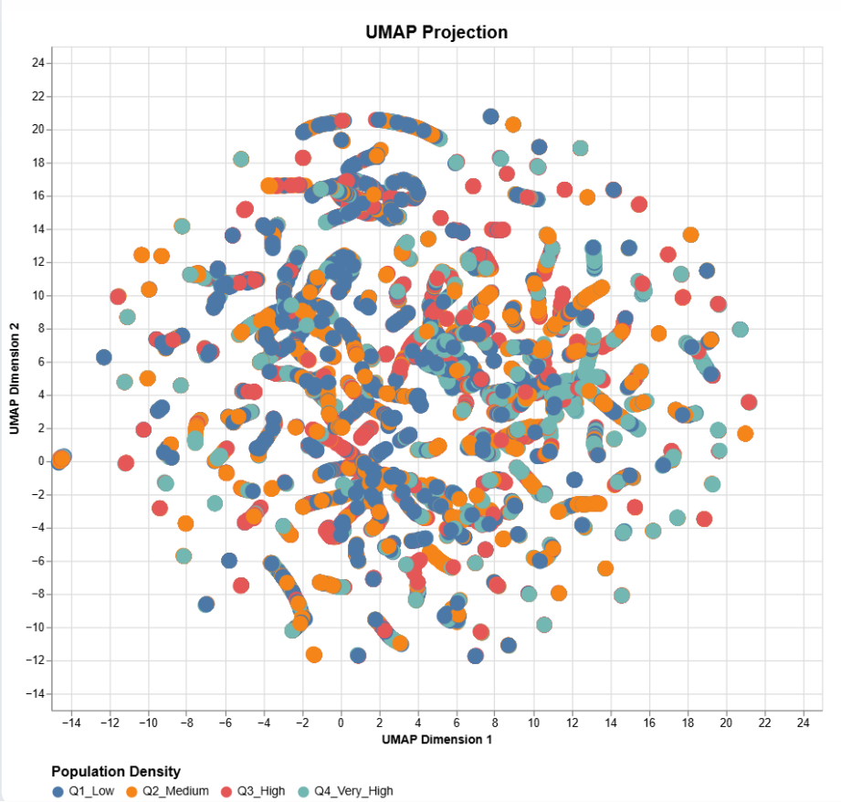
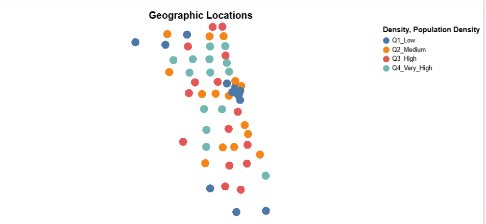
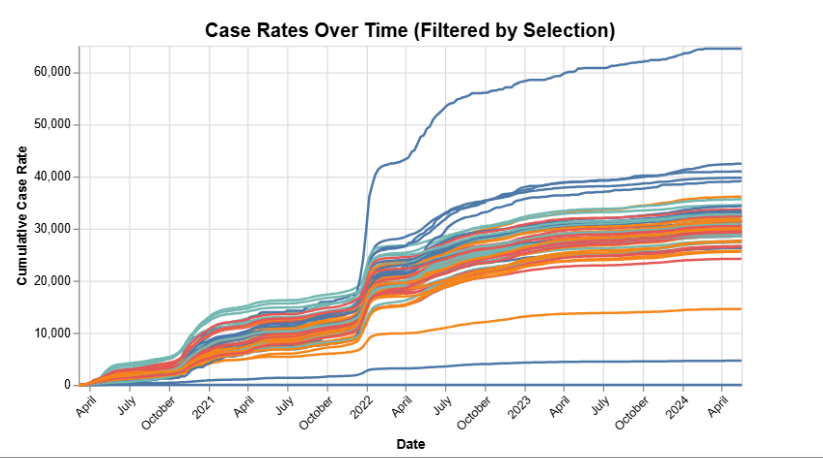
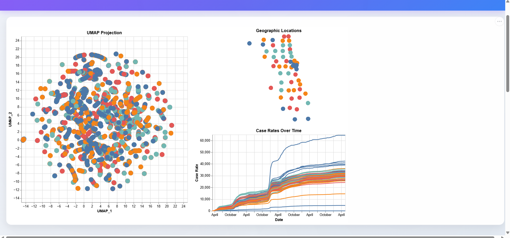
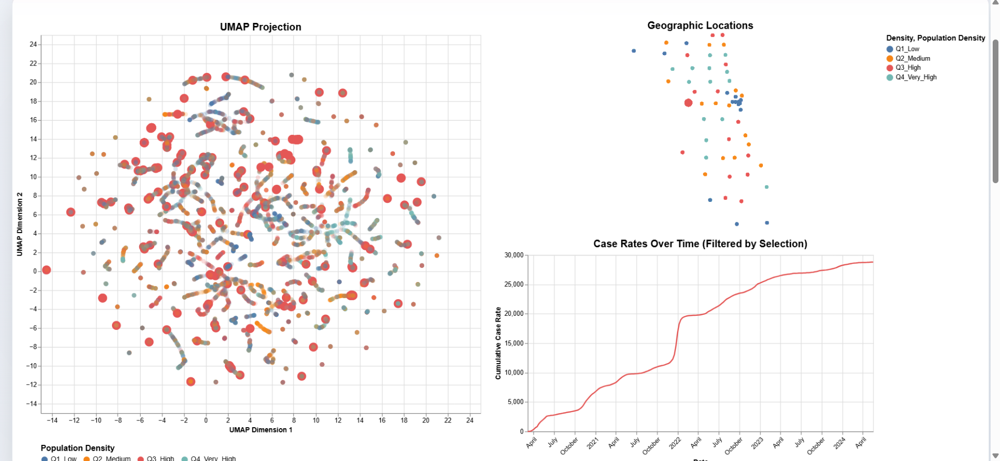
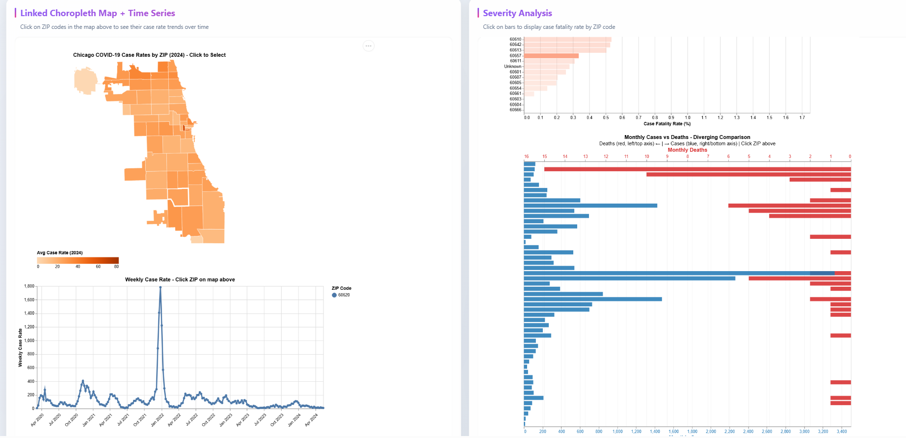
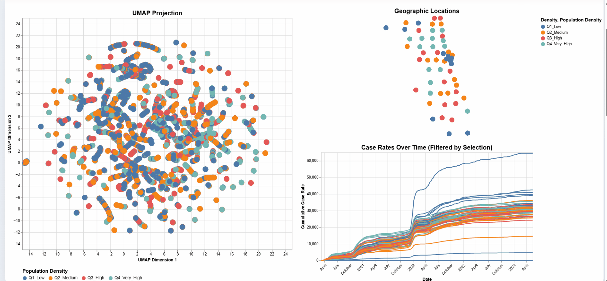

# Assignment 4 – COVID-19 Embedding Visualization

This project explores COVID-19 trends across Chicago ZIP Codes through dimensionality reduction and interactive visualization.  
Using embedding construction and UMAP, we transformed multidimensional public-health data into a 2D representation to reveal patterns like population-density clustering, temporal trajectories, and spatial disparities.

The final product is a standalone web interface with views that allow users to:
- Explore similarity in COVID-19 outcomes across neighborhoods  
- Connect abstract structure to geography  
- Analyze trends over time through linked selections

## Embedding Construction

### Preprocessing and Normalization
Some of the processes that were done in order to prepare the dataset for embedding were:

- **Cleaning:** Remove formatting characters like ```%``` or ```,``` from numeric columns.
- **Handling Missing Values:** We filled or dropped ```NaN``` values to ensure vector could be completed.
- **Scaling:** We applied ```MinMaxScaler``` to scale all numeric attributes to a [0,1] range. This ensures that large raw numbers do not dominate features with small decimals like positivity rate.

### Feature Selection

We chose 12 dimensions in order to construct the vector. These features helped to capture the severity, density, and the location of the COVID-19 outbreak.

**1. Cases - Cumulative**

**2. Cases - Weekly**

**3. Case Rate - Cumulative**

**4. Tests - Cumulative**

**5. Tests - Weekly**

**6. Test Rate - Cumulative**

**7. Percent Tested Positive - Cumulative**

**8. Percent Tested Positive - Weekly**

**9. Population (Demographic Context)**

**10. Longitude (Spatial Context)**

**11. Latitude (Spatial Context)**

**12. Stratum_Mean_Case_Rate (Aggregated group-based feature)**

### Aggregated Feature

There was a custom feature created called ```Stratum_Mean_Case_Rate```.
- **Method:** The ZIP codes were divided into four Population Density Quartiles (Low, Medium, High, Very High).
- **Calculation:** For every week, we created a calculated average case rate for the specific density group.
- **Rationale:** This allowed us to analyze how a specific ZIP Code is performing compared to other ZIP Codes of similar density.

### Dimensionality Reduction
We had a twelve-dimensional vector space get converted to a two-dimensional vector space.
- **Method:** ```UMAP``` (Uniform Manifold Approximation and Projection)
- **Rationale:** UMAP is a non-linear manifold learning techinique, this non-linearity was something that we were interested in to preserve local neighborhoods and structure. THis made it ideal for identifying clusters of similar behavior.

- **Parameters:**
    
    ``` n_neighbors```: 15 (Balances the local vs global structures)
    
    ``` min_dist```: 0.1 (Controls how tightly the points are placed together)
    
    ```n_components```: 2 (This creates a 2D visualization)

### Iterative Design Process

#### Iteration 1 : Raw Numeric Features & PCA

Initially, we selected only a small set of features, including `Cases - Cumulative`, `Tests - Cumulative`, and `Case Rate - Cumulative`, since these were the most emphasized metrics throughout the semester. As we explored the data further, we decided to include additional attributes that could reveal more detailed patterns, like weekly cases and weekly tests, allowing us to analyze the data at a more granular level.

When working with only three features, we initially chose **Principal Component Analysis (PCA)** because it is efficient and well-suited for linear relationships. However, as we examined the complexity and scale of our dataset, it became clear that reducing it to two dimensions using a linear method would oversimplify the structure and fail to preserve meaningful relationships in the data.

As a result, we moved to **Uniform Manifold Approximation and Projection (UMAP)**, a nonlinear dimensionality reduction technique that better captures local neighborhoods and underlying structure in complex data. Unlike PCA, which in our experience seemed to produce a dense, poorly separated projection, UMAP helped us create a more informative layout with clearer clustering and separation. This made UMAP a better fit for analyzing the COVID-19 data and identifying meaningful similarities between ZIP codes.


#### Iteration 2: Adding Aggregated Context

After switching to UMAP, we noticed that high-population ZIP codes were often mixed together with low-population ones, making it hard to identify density-based patterns. The embedding and visualizations at this stage didn't have meaningful “group” context, which limited our ability to compare ZIP codes within similar population categories. This was an analysis we were especially interested in exploring because we had not examined it like this in previous assignments.

To address this, we created two additional features: `Population_Stratum` and `Stratum_Mean_Case_Rate`. These features group ZIP codes into four population density levels (Low, Medium, High, and Very High) and compute the average case rate for each group. Adding this context greatly improved the embedding, as ZIP codes with similar population density and outbreak behavior now form clearer gradients and clusters within the final UMAP projection.

## Visualization Interface
Our interface integrates three coordinated views—UMAP embedding, geographic map, and temporal timeline—with bidirectional linking. Users can click points in the UMAP projection or circles on the map to select ZIP codes, and all three views update simultaneously. The timeline automatically filters to show only selected ZIP codes, enabling seamless exploration of COVID-19 patterns across dimensional, spatial, and temporal perspectives. The interface uses a shared selection parameter with persistent selection (clear: false) to support exploratory analysis workflows.

### UMAP Projection (Embedding View)
Projects ZIP codes into 2D space based on COVID-19 metrics (case rates, testing rates, deaths, population). Points are colored by population density stratum and sized based on selection state. Clicking points selects ZIP codes and highlights them across all views. 



This reveals natural clustering—ZIP codes with similar pandemic trajectories appear close together, enabling rapid identification of comparable neighborhoods.

### Geographic Locations (Spatial View)
Displays ZIP code centroids on a Mercator-projected map of Chicago. Circles are colored by population density and sized by selection. Clicking a location highlights that ZIP code across all views. This contextualizes abstract UMAP patterns with real geography, revealing spatial patterns and neighborhood-level disparities in COVID-19 outcomes.



### Case Rates Over Time (Temporal View)
Shows cumulative case rate trajectories for selected ZIP codes. Each selected ZIP automatically gets its own line, colored by population density. This view is reactive—it filters based on selections from the other two views. Reveals temporal heterogeneity, showing whether areas experienced early surges, steady growth, or late acceleration in case rates.



## Insights and Findings

### Key Patterns Discovered

**Population Density Dominates Clustering:** High-density ZIP codes (Q4_Very_High) cluster together in UMAP space and consistently show earlier surges and higher cumulative case rates (30,000+) compared to low-density areas (<15,000). Population density appears to be the primary factor determining pandemic trajectory.

**Geography ≠ Similarity:** Geographically adjacent ZIP codes sometimes occupy distant positions in UMAP space, indicating that factors beyond spatial proximity, such as socioeconomics, transportation access, or local policies, greatly influenced outcomes.

**Three Temporal Trajectory Types:**
1. Early surge with plateau (mid-2020)
2. Steady linear growth throughout period
3. Late acceleration (late 2020/early 2021)

These patterns correlate with but aren't entirely determined by population density.

**Spatial Outliers with Pattern Similarity:** Some geographically isolated ZIP codes cluster closely in UMAP space with non-adjacent areas, suggesting they share pandemic characteristics despite geographic separation, likely due to similar demographics or socioeconomic factors.

### Analytical Value

The bidirectional linking enables exploratory workflows:
- **Cluster → Geography:** Click UMAP clusters to see where similar ZIP codes are located
- **Geography → Patterns:** Select neighborhoods to see what other areas had similar experiences
- **Selection → Trends:** Any selection immediately reveals temporal trajectories

This multi-view approach reveals insights impossible to detect through separate, unlinked visualizations. 

For example, we can instantly see that high-density clusters in different parts of the city (North Side vs. South Side) experienced similar temporal patterns despite geographic distance, while low-density areas show more heterogeneous trajectories.


## Screenshots of Interface





## Live Demo

🔗 **Web Interface:** PUT URL HERE FOR HOSTED 

## Limitations & Future Work

### Limitations
- The embeddings are based on confirmed case and testing data, additional contextual factors such as income and housing were not included.
- UMAP involves randomness in its optimization process, so repeated runs can have slightly different layouts.
- Population groups were simplified so real demographic variation and might not capture all nuances in population distribution.

### Future Improvements
- Incorporate mobility and socioeconomic indicators such as public transit usage, income levels, and housing density.
- Support brushing-based selection in addition to clicking individual points.
- Introduce animated transitions to show how patterns evolve over time in the embedding space.
